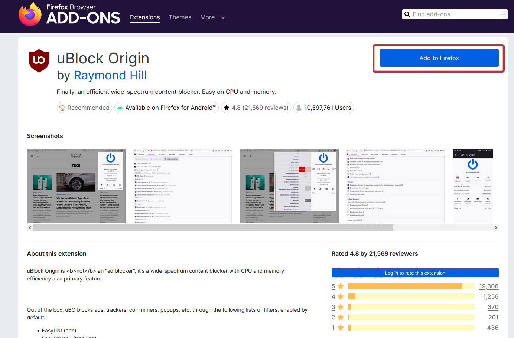

# **Премахване на реклами в браузъри**

Най-лесният начин да премахнем рекламите си в браузъра е като използваме **Разширение (Extension)** за браузъра. 
Има много различни разширения за блокиране на реклами, но най-ефективното и поддържано е **uBlock Origin**, което също така e и напълно безплатно, докато има други,
за които трябва да се плати. 

Инсталирането на разширения в браузъра става много лесно от магазина за разширения на браузъра. Процесът за всеки браузър е почти един и същ,
но с леки разлики спрямо потребителиския интерфейс на магазина и устройството (телефон или компютър). 

## 🖥 **За компютър**
*Примерен процес за* **Mozilla Firefox**:

Кликаме на бутона и чакаме да се изтегли. Това е!

## 🔗 **Ресурси за изтегляне и документация на uBlock Origin**
**❗ ВНИМАНИЕ: ВИНАГИ изтегляйте разширението от официалните линкове на uBlock Origin. Не носим отговорност, ако се заразите от злонамерено разширение от лош линк!** 
**Mozilla Firefox**: https://addons.mozilla.org/addon/ublock-origin/ 
**Microsoft Edge**: https://microsoftedge.microsoft.com/addons/detail/ublock-origin/odfafepnkmbhccpbejgmiehpchacaeak 
**Opera**: https://addons.opera.com/extensions/details/ublock/ 
**Google Chrome**: https://chromewebstore.google.com/detail/ublock-origin-lite/ddkjiahejlhfcafbddmgiahcphecmpfh 
 - Забележка за Google Chrome: Понеже Google Chrome актуализираха техния Manifest и пълната версия на uBlock Origin вече не е налична на този браузър и има версия наречена uBlock Origin Litе,
която също е от официалния разработчик. За повече информация относно тази промяна може да прочетете тук: https://github.com/uBlockOrigin/uBlock-issues/wiki/About-Google-Chrome's-%22This-extension-may-soon-no-longer-be-supported%22 

**Документация на uBlock Origin**: https://github.com/gorhill/uBlock?tab=readme-ov-file#documentation

## ⭐ **Източници**
https://github.com/gorhill/uBlock?tab=readme-ov-file#ublock-origin
