# **Премахване на реклами в Reddit приложението**

## ℹ Този урок за момента е предназначен само за Android устройства (в бъдеще ще има и за iOS устройства, т.е. iPhone)

# ❗ ВНИМАНИЕ: Винаги изтегляйте приложенията, APK файловете и модулите от техните ОФИЦИАЛНИ източници!!!
  - Не носим отговорност за заразени устройства, хакнати акаунти, както и всякакъв вид инсталиран злонамерен софтуер на вашите устройства.

## **Термини**:
 - **APK** (Android Application Package/Android Package Kit): Инсталационният файл за приложения на **Android** - нещо като **.exe** файл при Windows.
Чрез него се инсталират приложенията на **Android** устройствата.

# 🤖 **Android:**

Ще представим 2 начина за премахване на рекламите в мобилното **Reddit** приложение: 
 1. Модифициране на **Reddit APK** файла чрез **Morphe Manager**
 2. Използване на **LSPosed** модул, който модифицира **Reddit** приложението в реално време, без да има нужда да се модифицира **APK** файлът
    - ❗ Този метод изисква да имате **Root** достъп на вашия **Android** както и настроен **LSPosed**
   
## Вариант 1:
 1. Изтегляме **Morphe Manager**
    - Отваряме **Github** хранилището на **Morphe Manager**: https://github.com/MorpheApp/morphe-manager
    - Отиваме долу, докато не намерим панела **Releases** и кликаме на последния **Release**
    - 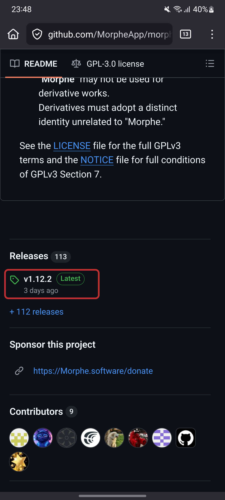
    - Отваря ни се друга страница, на която ни излизат файловете, които съдържа **Release-ът**, който сме си избрали. Кликаме на файла, който завършва на **".APK"**
    - 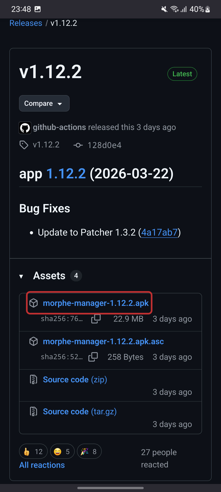
    - Ще ни се отвори известие, което ще ни попита дали желаем да изтеглим файла, кликаме "да".
 2. Намиране на инсталационния файл (**APK**) **Morphe Manager** във файлов мениджър
    - Отваряме си нашия любим файлов мениджър.
      - ℹ В зависимост от марката на телефона Ви може да имате различен файлов мениджър. Тук използваме стандартния файлов мениджър на **Samsung** (от **One UI**). Ако не намирате файлов мениджър на Вашия телефон, то тогава Ви препоръчваме да си изтеглите **Material Files**: https://play.google.com/store/apps/details?id=me.zhanghai.android.files
    - 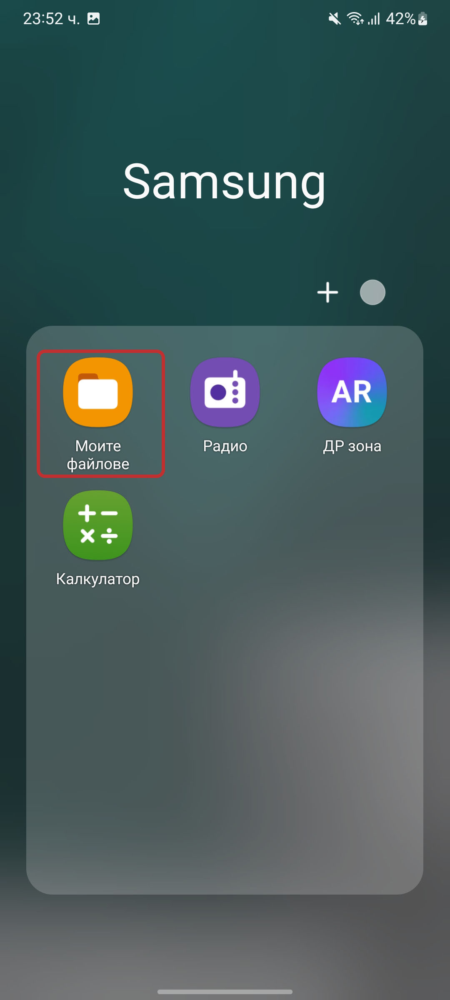
    - Когато сме във файловия мениджър, трябва да намерим директорията, в която ни се съхраняват изтеглините файлове. Има множество варианти, от които може да достигнем до тази директория или изтегления ни файл.
    - 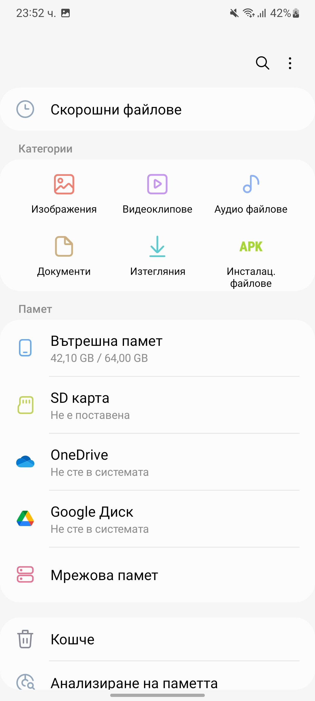 
      - Първият е чрез кликане на бутона **"Скорошни файлове"**. Ще ни се отвори директория, в която ще ни излезнат всички скорошни файлове на телефона от типа на документи, изтеглени файлове, снимки и т.н. (не включва системни файлове или файлови данни относно някое приложение)
      - Вторият е чрез кликане на бутона **"Изтегляния"**
      - Третият е чрез ръчно навигиране до папката **Download** - за него използваме бутона **"Вътрешна памет"**
      - Има и още варианти за достигане до инсталационния файл...
    - Ръчна навигация до папката **Download** (примерът е във файловия мениджър на **Samsung**)
      - След като кликнем бутона за **Вътрешна памет/Вътрешно хранилище/Хранилище** ще ни се отвори вътрешното хранилище на телефона. Търсим папката Download, която би трябвало винаги да е в тази директория, без да се налага да отваряме други папки. В зависимост от файловия мениджър - например, в **Material Files** още след отварянето му директно се намираме в директорията **Вътрешна памет/...**
    - 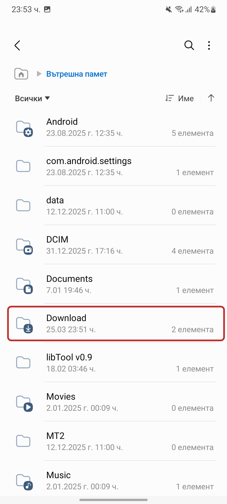 
  3. Инсталиране на **Morphe Manager**
     - След като открием инсталационния файл (**APK**) на **Morphe Manager** трябва да кликнем на него, за да процедираме с инсталирането му
     - 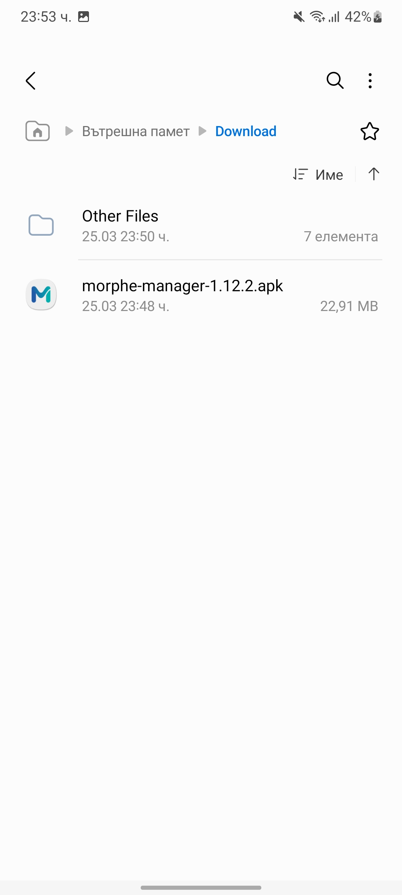 
     - Ако инсталирате за първи път **APK** файл от файловия мениджър или приложението, в което процедирате да инстлирате **Morphe Manager**, ще ви се отвори известия, в което ще Ви уведомят, че приложението няма права да инсталира други приложения. Това можем да го променим в настройките. Повечето **Android** системи имат страхотен бутон при такъв тип известие, който директно ни препраща към правилното място.
     - 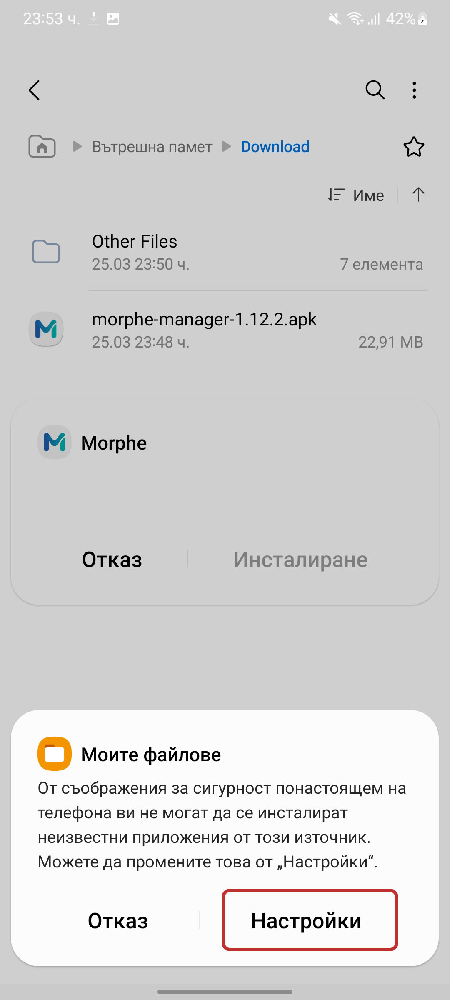 
     - Кликаме **"Настройки"**. Бутонът може да е различен в зависимост от системата на **Android**, която използвате
     - Отварят ни се настройките относно "**Инсталиране на неизвестни приложения**"
     - Даваме право на файловия ни мениджър да може да инсталира неизвестни приложения
     - 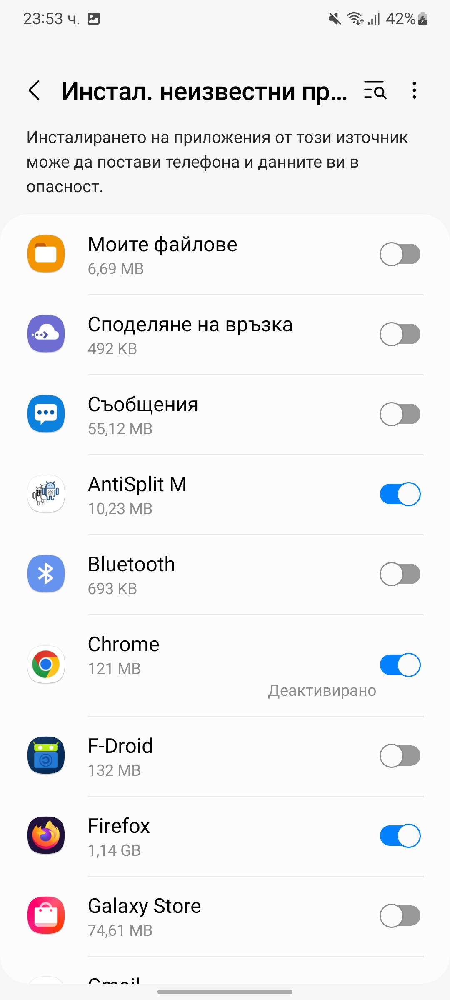 
     - След като дадем право на нашия източник, който използваме за инсталиране на **Morphe Manager**, ще ни се отвори диалог относно инсталирането му. Ако без да искате затворите диалога, може да се върнете към по предните стъпки, за да намерите **APK** файла отново и процедирате отново с неговата инсталация - няма да Ви изисква отново да давате права.
     - Кликаме **"Инсталиране"** и чакаме търпеливо приложението да се инсталира :)
     - 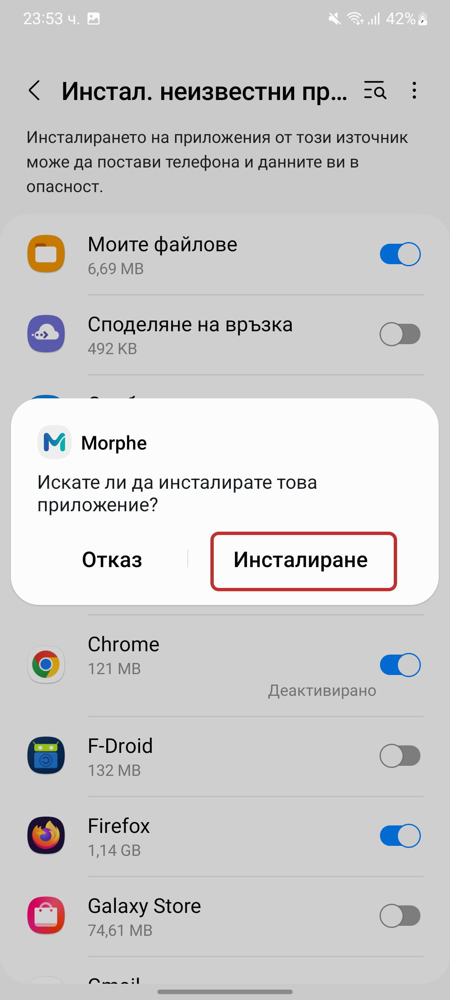 
     - Ако инсталацията е успешна, ще получите този диалог. Ако получите съобщение от тип, че приложението не може да се инсталира, то тогава ще тряба да намерите причината си сами (нямаме урок за момента относно намиране на причината при неуспешно инсталиране на приложение). За съжаление, **Android** нямат лесен начин за намиране на причината относно неуспешна инсталация на приложение
     - 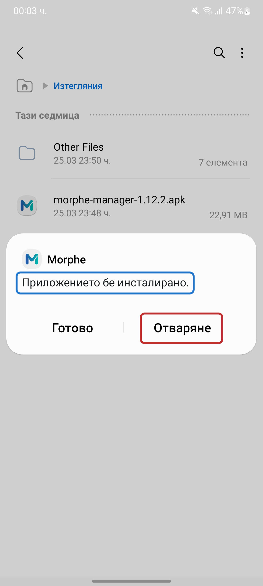 
     - **Morphe (Morphe Manager)** става изцяло самостоятелно приложение на вашия телефон както всяко друго. Ще можете да го намерите на екрана си заедно с другите приложения.
  4. Модифициране на оригиналното **Reddit** приложение чрез **Morphe**
     - След като отворим **Morphe** ще получим запитване какво приложение желаем да модифицираме. За момента поддържаните приложения са **Youtube**, **Youtube Music** и **Reddit**
     - Избираме **Reddit**
     - 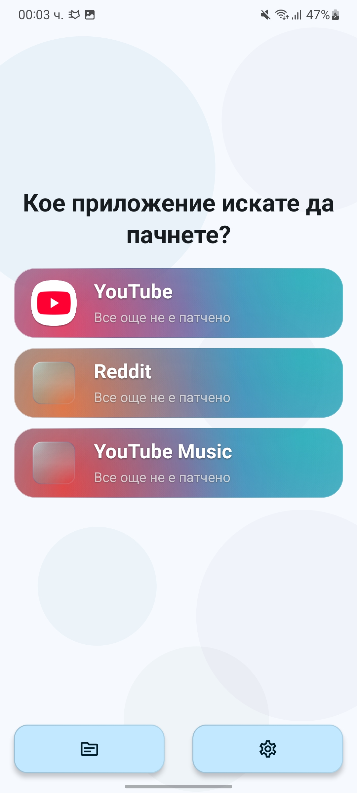 
     - Ще получим екран, в който ще ни попитат да предоставим оригинален **APK** файл за модификация
     - Понеже в момента нямаме **APK** файл за **Reddit**, трябва да се снабдим с такъв. Има много начини за снабдяване с **APK** файлове, но за този урок ще използваме препоръчания метод директно от **Morphe** чрез **APKMirror**
     - 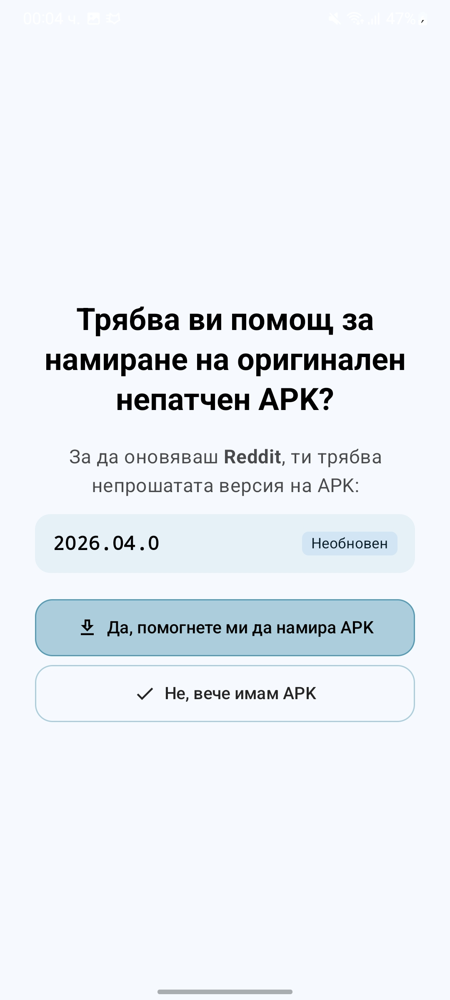 
     - След като кликнем бутона ще получим инструкции относно как да изтегляме от **APKMirror**
     - Кликаме да продължим към **APKMirror** - по този начин ще бъдем препратени директно към **APKMirror** сайта с точната поддържана и стабилна версия на оригиналния **Reddit**. Ако решите да изтегляте **APK** файл ръчно, то тогава знайте, че версията има значение.
     - 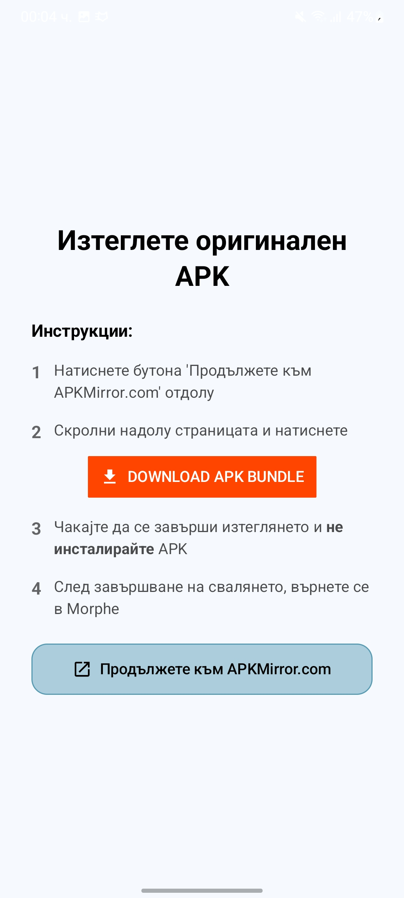 
     - Отваря ни се сайта на **APKMirror**. Отиваме малко по-долу, докато не намерим бутона **Download Apk Budnle/Download Apk** (в зависимост дали e Split APK или не) и кликаме на него, за да изтеглим **APK** файла.
     - **❗ ВНИМАВАЙТЕ ЗА ФАЛШИВИ Download БУТОНИ!!!**
     - 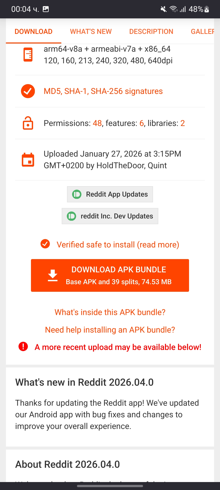 
     - След като файлът е изтеглен може да се върнем директно в приложението и да процедираме с избирането на файла
     - 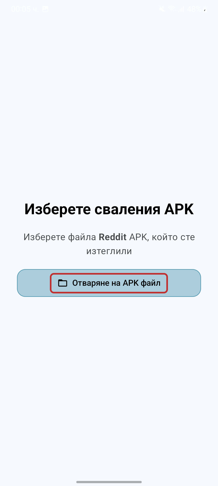 
     - Ако обаче сте затворили приложението или се рестартира и трябва да започнете отново, не се притеснявайте, повтерете стъпките, но вместо да избирате бутона за помощ за намиране на **APK** файл, избираме другия, че вече имаме файл
     - 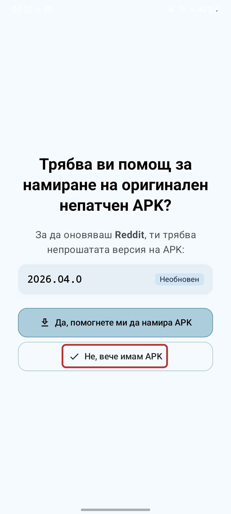 
     - Получаваме прозорец, независимо кой от методите сме избрали, в който трябва да избререм нашия **APK** файл
     - 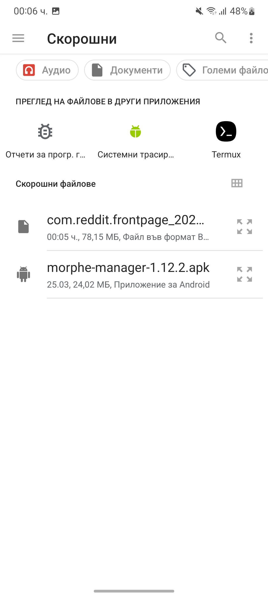 
     - В зависимост от къде последно сте избирали файл може да ви изпрати в **"Скорошни"**, **"Изтегляния"** и т.н.
     - Ако изпитвате трудност да намерите вашия файл, може да кликнете на трите линии горе в ляво и ще се отвори диалог относно избиране на файл от друга по Ваш избор директория
     - 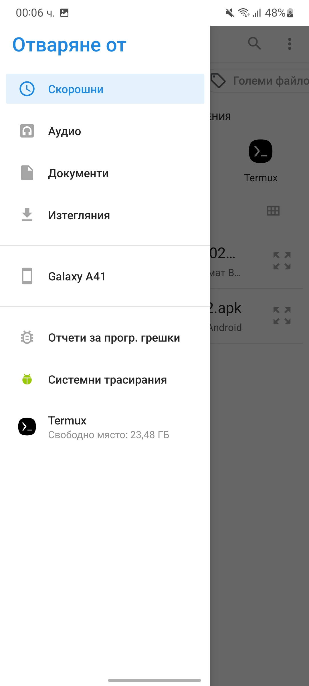 
     
     
